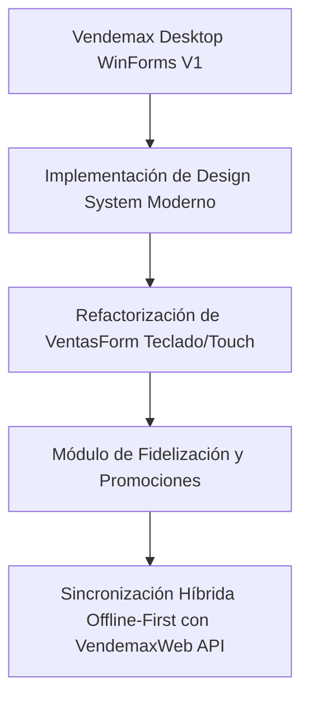

# Especificación de Funcionalidades V2 y Roadmap Tecnológico

## 1. Módulos y Agregados Funcionales V2

### A. Gestión de Variantes y Unidades Complejas
- **Variantes de Producto:** Definición de Atributos (Talle, Color, Sabor, Material) bajo un mismo código padre.
- **Unidades Múltiples:** Venta por Fracción (Kilos, Gramos, Metros) y conversión automática (ej. Comprar Caja x24 y vender por Unidad).

### B. Programa de Fidelización (Puntos y Clientes)
- **Acumulación de Puntos:** Configuración de reglas (ej. $1000 = 10 puntos).
- **Canje en Caja:** Aplicar puntos directamente como método de pago o descuento en el ticket activo.

### C. Promociones Complejas y Descuentos Dinámicos
- Reglas automáticas en el motor de venta:
  - 2x1 en productos seleccionados.
  - Descuento acumulado por categoría (ej. 15% off en Lácteos llevando 3 o más).
  - Descuento por pago en Efectivo.

### D. Asistente de Reabastecimiento e Inventario Inteligente
- Cálculo del tiempo estimado de agotamiento de stock según historial de ventas.
- Generación automática de Sugerencia de Orden de Compra exportable a PDF/Excel para enviar a proveedores.

---

## 2. Roadmap Tecnológico y Arquitectura de Migración

### Plan por Fases:
1. **Fase 1: Rediseño Visual Core (Semanas 1-3)**
   - Aplicación del nuevo paleta de colores y componentes visuales en Menú Principal, Login y Dashboard.
2. **Fase 2: Experiencia de Caja y Cobro Express (Semanas 4-6)**
   - Optimización de `VentasForm` con atajos globales y selector de modo Touch/Teclado.
3. **Fase 3: Nuevas Funcionalidades Comerciales (Semanas 7-9)**
   - Integración de Variantes, Puntos de Cliente y Promociones Complejas.
4. **Fase 4: Sincronización Nube Híbrida (Semanas 10-12)**
   - Conexión silenciosa en segundo plano con la base de datos de VendemaxWeb.
